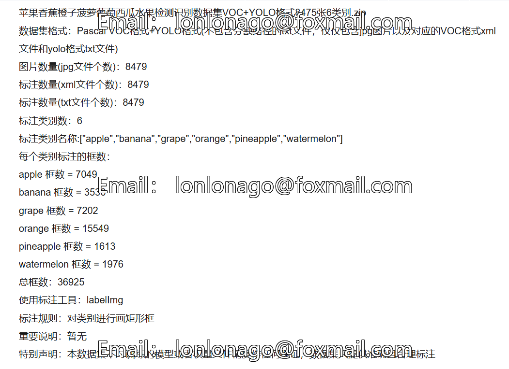
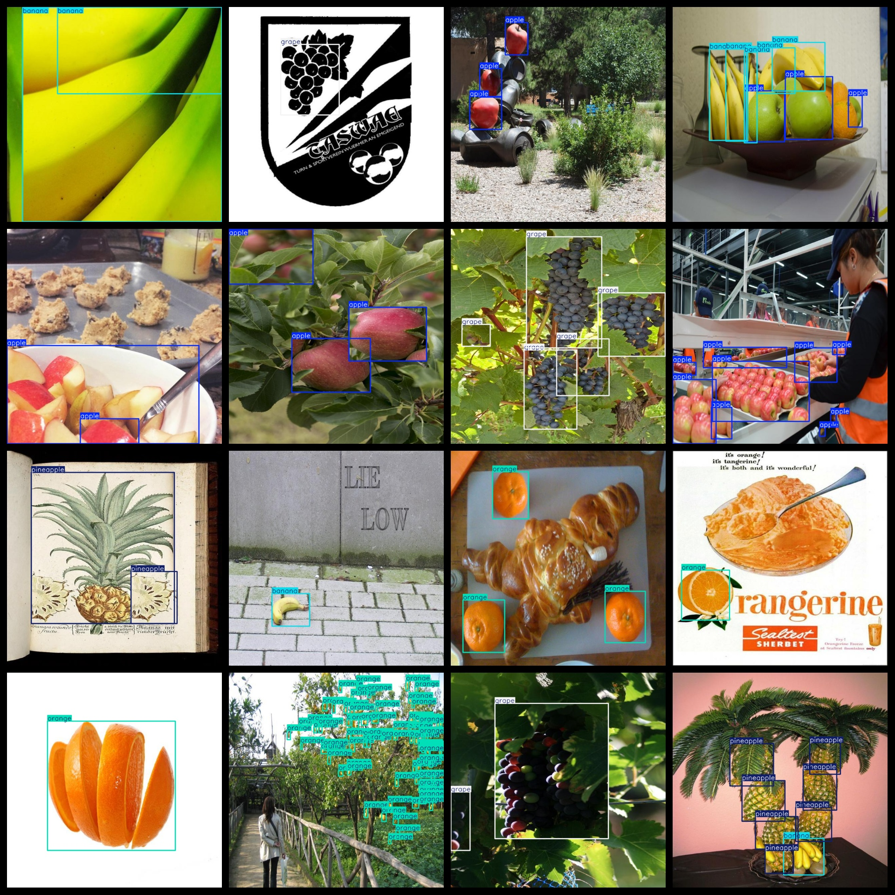

# [Object Detection] Apple Banana Orange Pineapple Grape Watermelon Fruit Detection Recognition Dataset VOC+YOLO format8475 images6-class

Dataset Description: ~

Apple Banana Orange Pineapple Grape Watermelon Fruit Detection Recognition Dataset VOC+YOLOformat 8475stretch6Classes.zip

Dataset format: Pascal VOC format + YOLO format (the txt file does not contain the split path, it only contains jpg images and corresponding VOC format xml files and yolo format txt files)

Number of images (number of jpg files): 8479

Number of annotations (number of xml files): 8479

Number of annotations (number of txt files): 8479

Number of categories: 6

Annotation class names: ["apple","banana","grape","orange","pineapple","watermelon"]

Number of boxes labeled in each category:

apple frame count = 7049

banana frame count = 3536

grape frame count = 7202

orange frame count = 15549

pineapple frame count = 1613

watermelon frame count = 1976

Total boxes: 36925

Use the labeling tool: labelImg

Rules for annotation: Draw a rectangle around the category.

Important Note: None

Special Notice: This dataset does not guarantee the accuracy or precision of the trained models or weight files. The dataset only provides accurate and reasonable annotations.

## Images

---

Here is a pay link on Stripe (https://buy.stripe.com/3cs8yP7sY87d0vu9AB). Please contact me lonlonago@foxmail.com after funding $89, and I will send you a complete data files, thank you!

